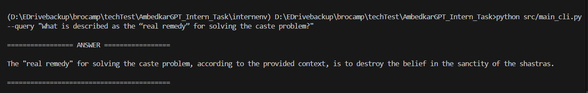

# AmbedkarGPT-Intern-Task
# 📘 AmbedkarGPT – RAG-based CLI Q&A System

A command-line Question–Answering system built using Retrieval-Augmented Generation (RAG) on Dr. B.R. Ambedkar’s speech.  
You ask a question → system retrieves relevant text → Mistral LLM generates an answer.

---

## 🚀 Features

- Command-line interface for Q&A  
- Loads speech from a text file  
- Splits text into chunks (`chunk_size=350`, `overlap=50`)  
- Creates embeddings & stores them in ChromaDB  
- Retrieves similar chunks for a given question  
- Uses ollama+ **Mistral LLM** to generate a final answer  
- Includes logging, config file, and error handling  

---

## 🗂️ Project Architecture


## 📁 Project Structure (with explanations)


src/
├── __init__.py               # Marks folder as a Python package
│
├── config.py                 # All configuration values (paths, model names, keys, chunk sizes)
│
├── document_processor.py     # Reads speech.txt, splits into chunks, creates Document objects
│
├── embedding.py              # Loads embedding model & generates vector embeddings
│
├── exception.py              # Custom exception classes for cleaner error handling
│
├── llm.py                    # Loads Mistral LLM & handles answer generation
│
├── logger.py                 # Centralized logging setup & helper functions
│
├── main_cli.py               # CLI entry point → takes user query → runs RAG pipeline → prints answer
│
├── rag_pipeline.py           # Full RAG workflow (retrieval + merging + reranking + LLM answer)
│
├── retriever.py              # Vector search + BM25 search + ensemble merge logic
│
└── vectordb.py               # ChromaDB initialization, insert & load operations


## 🛠️ Technologies Used

| Category | Technology | Purpose |
|----------|------------|---------|
| Programming Language | **Python 3.12+** | Core implementation of CLI & RAG pipeline |
| Vector Database | **ChromaDB** | Stores embeddings & enables vector similarity search |
| Embeddings | **Sentence-Transformers** | Converts text chunks into dense vectors |
| Retrieval | **Chroma Vector Search**, **BM25 (LangChain)** | Hybrid retrieval (semantic + keyword) |
| Reranking | **Cohere Rerank API** | Improves document relevance ranking |
| LLM (Local) | **Ollama + Mistral** | Local inference for RAG; no API usage |
| Orchestration | **LangChain** | Handles Documents, Retrievers, LLM connections |
| CLI App | **Python argparse / custom main_cli.py** | Command-line interface for user queries |
| Logging | **Python logging module** | Centralized logs stored in `/logs/` |
| Configuration | **config.py + python-dotenv** | Store paths, keys, chunk sizes, model settings |
| Error Handling | **Custom Exception Classes** | Unified exception flow & cleaner debugging |


##  How to Run the Project

Follow the steps below to set up and run the RAG system:

---

###  Install Dependencies

Make sure you have Python 3.12+ installed.

```bash
conda create ./env python=3.12
conda activate ./env
pip install -r requirements.txt
```
### Start the Mistral Model (via Ollama)
```bash
ollama run mistral
```
###  Run the CLI Application

```bash
python src/main_cli.py --query "According to the passage, why is abolishing caste linked to rejecting the sanctity of the shastras?"
python src/main_cli.py --query "What is described as the “real remedy” for solving the caste problem?"
```
### Result
