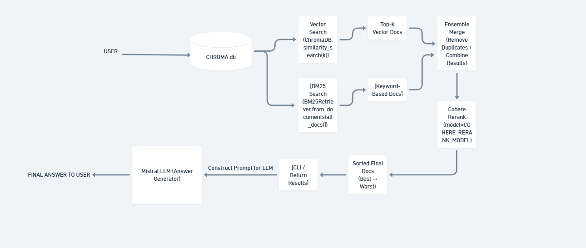

# AmbedkarGPT-Intern-Task
# 📘 AmbedkarGPT – RAG-based CLI Q&A System

A command-line Question–Answering system built using Retrieval-Augmented Generation (RAG) on Dr. B.R. Ambedkar’s speech.  
You ask a question → system retrieves relevant text → Mistral LLM generates an answer.

---

## 🚀 Features

- Command-line interface for Q&A  
- Loads speech from a text file  
- Splits text into chunks (`chunk_size=200`, `overlap=50`)  
- Creates embeddings & stores them in ChromaDB  
- Retrieves similar chunks for a given question  
- Uses **Mistral LLM** to generate a final answer  
- Includes logging, config file, and error handling  

---

## 🗂️ Project Architecture

## 📁 Project Structure (with explanations)

src/
├── init.py # Marks folder as a Python package
│
├── config.py # All configuration values (paths, model names, keys, chunk sizes)
│
├── document_processor.py # Reads speech.txt, splits into chunks, creates Document objects
│
├── embedding.py # Loads embedding model & generates vector embeddings
│
├── exception.py # Custom exception classes for cleaner error handling
│
├── llm.py # Loads Mistral LLM & handles answer generation
│
├── logger.py # Centralized logging setup & helper functions
│
├── main_cli.py # CLI entry point -> takes user query -> runs RAG pipeline -> prints answer
│
├── rag_pipeline.py # Full RAG workflow (retrieval + merging + reranking + LLM answer)
│
├── retriever.py # Vector search + BM25 search + ensemble merge logic
│
└── vectordb.py # ChromaDB initialization, insert & load operations